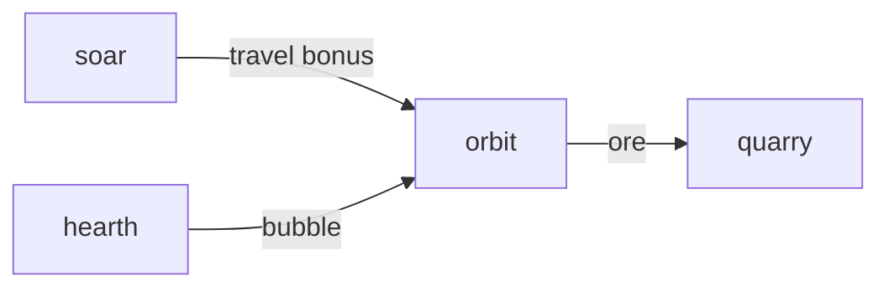

# Orbit

**Pet Space Explorer** — Idle star map: send pets to distant planets for ores used in gear.

Part of [ComputerPets](https://github.com/RicheyWorks/computerpets). Map: [computerpets-ecosystem](https://github.com/RicheyWorks/computerpets-ecosystem).

| | |
| --- | --- |
| Status | Design scaffold — loop and engine frozen |
| License | MIT |
| Tokens | Minigames never mint or burn. Tired overlay, not a dead lineage. |
| First pet | [Meet Rui first](https://github.com/RicheyWorks/computerpets/blob/main/docs/START-HERE.md). This game is optional. |

## The loop

Delve is dungeons. Orbit is the sky. Species with flight traits (Soar) travel faster. Reef pets hate vacuum — they need a habitat bubble from Hearth.

## Who plays

Idle players. Flight pets go faster; reef pets need a bubble.

## What it is not

NASA fanfic that breaks Lore. Catch-up capped at 8h.

## Genre and engine

- Genre: **Sci-fi idle**
- Engine: **Vue / PixiJS**
- Stack: Vue 3 · PixiJS star map · idle expeditions · ores → gear crafting
- Default surface: `5173`

## Architecture



## How you play

1. Unlock systems on a Pixi map.
2. Assign pets + travel time.
3. Ore → forge stats for Arena/Siege.
4. Flavor text from Lore, not NASA fanfic that breaks canon.

## First slice

Build this and stop.

**One nearby system, Rui with a habitat bubble, ore into a craft bench.**

You know it works when: Vacuum without bubble refused. Park-a-year catch-up will not print a fortune.

## Environment

Node 22

## Failure doctrine

Assign a non-flight pet to vacuum without bubble → refuse. Idle tick missed → catch-up cap 8h so nobody parks a year.

Canon rules that never yield:

- 210 living kinds. No illegal hybrids.
- Overlay pets can get tired, sick, or hide. Tokens are not burned by a minigame.
- Desktop walk stays the main quest. Closing Orbit must leave Rui walking.

## Neighbors

- computerpets-delve
- computerpets-soar
- computerpets-quarry
- computerpets-minter (crafted gear)
- computerpets-hearth

## Layout

```
computerpets-orbit/
  README.md
  LICENSE
  docs/DESIGN.md
  src/                implementation lands here
```

## Run (Windows)

```powershell
cd app; npm install; npm run dev
```

Meet Rui first via the [flagship start-here](https://github.com/RicheyWorks/computerpets/blob/main/docs/START-HERE.md). This game is optional.

## Links

- Flagship: [RicheyWorks/computerpets](https://github.com/RicheyWorks/computerpets)
- This repo: [RicheyWorks/computerpets-orbit](https://github.com/RicheyWorks/computerpets-orbit)
- Map: [RicheyWorks/computerpets-ecosystem](https://github.com/RicheyWorks/computerpets-ecosystem)
- Design file: [docs/DESIGN.md](docs/DESIGN.md)

## License

MIT. See [LICENSE](LICENSE).

---

*Two hundred ten living kinds. Keep them so a line does not go quiet.*
