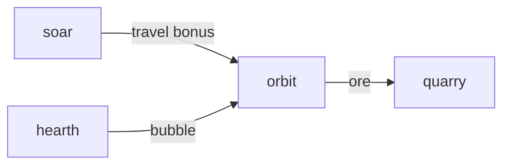

# Orbit

**Pet Space Explorer** — A planned idle space game where pet expeditions gather ore for crafting.

Part of [ComputerPets](https://github.com/RicheyWorks/computerpets). Map: [computerpets-ecosystem](https://github.com/RicheyWorks/computerpets-ecosystem).

[Status](#status) · [Design](docs/DESIGN.md) · [Contributor start](#contributor-start) · [Ecosystem](https://github.com/RicheyWorks/computerpets-ecosystem)

| Project | At a glance |
| --- | --- |
| Status | Design scaffold; not runnable yet |
| License | MIT |
| Tokens | Minigames never mint or burn. Tired overlay, not a dead lineage. |
| First pet | [Flagship start guide](https://github.com/RicheyWorks/computerpets/blob/main/docs/START-HERE.md) |

## Status

This repository contains a [design](docs/DESIGN.md) and a [source placeholder](src/index.ts). It has no runnable application, build manifest, automated tests, or CI workflow.

The experience, interfaces, integrations, and safeguards below are **implementation plans**, not supported features. The first implementation slice defines the initial contribution target.

## Planned experience

Delve is dungeons. Orbit is the sky. Species with flight traits (Soar) travel faster. Reef pets hate vacuum — they need a habitat bubble from Hearth.

## Intended audience

Idle players. Flight pets go faster; reef pets need a bubble.

## Out of scope

NASA fanfic that breaks Lore. Catch-up capped at 8h.

## Planned genre and engine

- Genre: **Sci-fi idle**
- Engine: **Vue / PixiJS**
- Stack: Vue 3 · PixiJS star map · idle expeditions · ores → gear crafting
- Proposed surface: `5173`

## Proposed integration



## Proposed play loop

1. Unlock systems on a Pixi map.
2. Assign pets + travel time.
3. Ore → forge stats for Arena/Siege.
4. Flavor text from Lore, not NASA fanfic that breaks canon.

## First implementation slice

Initial implementation target:

**One nearby system, Rui with a habitat bubble, ore into a craft bench.**

Acceptance targets: Vacuum without bubble refused. Park-a-year catch-up will not print a fortune.

## Planned environment

Node 22

## Planned safeguards

Assign a non-flight pet to vacuum without bubble → refuse. Idle tick missed → catch-up cap 8h so nobody parks a year.

Design constraints:

- 210 living kinds. No illegal hybrids.
- Overlay pets can get tired, sick, or hide. Tokens are not burned by a minigame.
- Desktop walk stays the main quest. Closing Orbit must leave Rui walking.

## Related projects

- [computerpets-delve](https://github.com/RicheyWorks/computerpets-delve)
- [computerpets-soar](https://github.com/RicheyWorks/computerpets-soar)
- [computerpets-quarry](https://github.com/RicheyWorks/computerpets-quarry)
- [computerpets-minter](https://github.com/RicheyWorks/computerpets-minter) (crafted gear)
- [computerpets-hearth](https://github.com/RicheyWorks/computerpets-hearth)

## Layout

```
computerpets-orbit/
  README.md
  LICENSE
  docs/DESIGN.md
  src/                implementation lands here
```

## Contributor start

With Git and PowerShell, clone the scaffold and read its design and source marker:

```powershell
git clone https://github.com/RicheyWorks/computerpets-orbit.git
Set-Location computerpets-orbit
Get-Content .\docs\DESIGN.md
Get-Content .\src\index.ts
```

Start with the [first implementation slice](#first-implementation-slice). Add the minimum project setup and tests needed for that slice, then document verified run commands. The proposed stack above is a design choice; there is no install or launch command for this checkout yet.

## Links

- Flagship: [RicheyWorks/computerpets](https://github.com/RicheyWorks/computerpets)
- This repo: [RicheyWorks/computerpets-orbit](https://github.com/RicheyWorks/computerpets-orbit)
- Map: [RicheyWorks/computerpets-ecosystem](https://github.com/RicheyWorks/computerpets-ecosystem)
- Design file: [docs/DESIGN.md](docs/DESIGN.md)

## License

MIT. See [LICENSE](LICENSE).

---

*Two hundred ten living kinds. Keep them so a line does not go quiet.*
